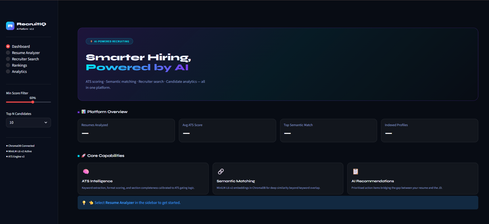
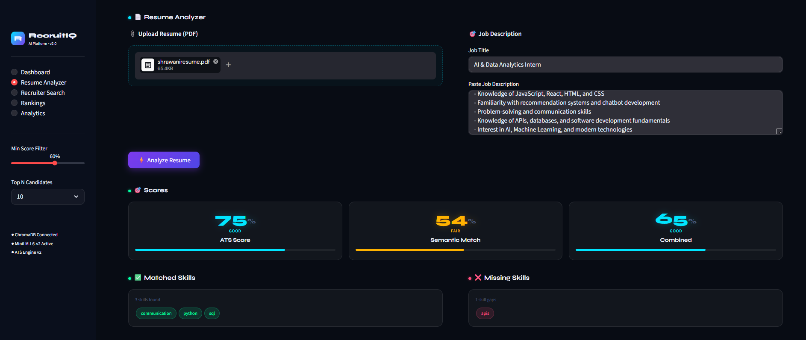
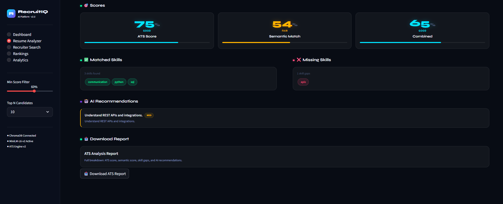
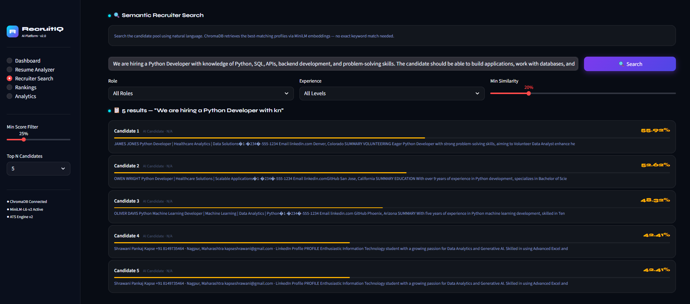
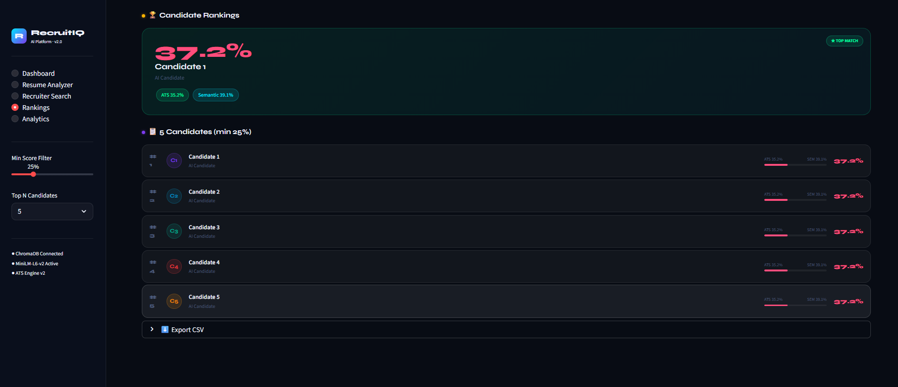
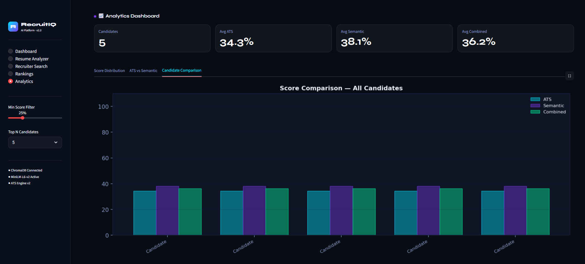

# 🚀 Semantic Resume Analyzer

AI-powered resume analysis and semantic recruiter search platform built using NLP, semantic embeddings, ChromaDB, and ATS scoring.

---

## 🚀 Live Demo

🔗 [semantic-resume-analyzer.streamlit.app](https://semantic-resume-analyzer-ahaav3ugphngksxsumyznw.streamlit.app/)

---

## 📸 Dashboard Preview

### 🏠 Main Dashboard



---

### 📄 Resume Analyzer



<br>



---

### 🔎 Semantic Recruiter Search



---

### 🏆 Candidate Rankings



---

### 📈 Analytics Dashboard



---

## ✨ Features

- ✅ ATS Resume Scoring
- ✅ Semantic Resume Matching
- ✅ AI-Powered Recruiter Search
- ✅ ChromaDB Vector Database Integration
- ✅ Candidate Ranking System
- ✅ Analytics Dashboard
- ✅ Missing Skills Detection
- ✅ AI Resume Recommendations
- ✅ PDF Report Generation
- ✅ Interactive Streamlit UI

---

## 🧠 Tech Stack

### 💻 Frontend

- Streamlit
- HTML/CSS
- Python

### 🤖 AI / NLP

- Sentence Transformers
- MiniLM-L6-v2 Embeddings
- Semantic Similarity Matching
- NLP-based Skill Extraction

### 🗄️ Database

- ChromaDB Vector Database

### 📊 Data Visualization

- Matplotlib
- Pandas
- NumPy

### 📑 Report Generation

- ReportLab

---

## 📂 Project Architecture

```bash
Semantic-Resume-Analyzer/
│
├── app/
│   ├── ai_engine/
│   │   ├── ats/
│   │   │   └── ats_score.py
│   │   │
│   │   ├── embeddings/
│   │   │   └── semantic_matcher.py
│   │   │
│   │   ├── parser/
│   │   │   ├── resume_parser.py
│   │   │   └── skill_extractor.py
│   │   │
│   │   └── recommendations/
│   │       └── recommender.py
│   │
│   ├── database/
│   │   ├── chroma_store.py
│   │   ├── load_dataset.py
│   │   └── test_search.py
│   │
│   ├── frontend/
│   │   └── streamlit_app.py
│   │
│   ├── utils/
│   │   └── report_generator.py
│   │
│   └── data/
│       ├── resumes/
│       └── jobs/
│
├── requirements.txt
├── README.md
└── .gitignore
```

---

## ⚙️ How It Works

1. Upload a resume in PDF format.
2. Paste a job description.
3. ATS engine analyzes keyword relevance.
4. NLP parser extracts important skills.
5. Semantic embedding engine compares resume and job description.
6. ChromaDB retrieves semantically similar candidate profiles.
7. Rankings and analytics are generated automatically.

---

## 📦 Installation

### Clone Repository

```bash
git clone https://github.com/shrawanikapse09/Semantic-Resume-Analyzer.git
cd Semantic-Resume-Analyzer
```

### Create Virtual Environment

```bash
python -m venv venv
```

### Activate Virtual Environment

#### Windows

```bash
venv\Scripts\activate
```

#### Mac/Linux

```bash
source venv/bin/activate
```

### Install Dependencies

```bash
pip install -r requirements.txt
```

---

## ▶️ Run Application

```bash
streamlit run app/frontend/streamlit_app.py
```

---

## 📊 Core Modules

### 📄 Resume Analyzer

Analyzes resumes using ATS scoring and semantic matching.

### 🔎 Recruiter Search

Uses semantic embeddings and ChromaDB for intelligent candidate retrieval.

### 🏆 Rankings

Ranks candidates using combined ATS and semantic scores.

### 📈 Analytics

Visualizes candidate performance using charts and dashboards.

### 🤖 Recommendations

Provides AI-generated resume improvement suggestions.

---

## 🔮 Future Enhancements

- Recruiter authentication system
- Cloud deployment
- OpenAI/Gemini integration
- Advanced analytics dashboard
- Real-time database support
- Resume upload portal
- Email-based report sharing
- Multi-role recommendation engine

---

## 📚 Learning Outcomes

This project demonstrates practical implementation of:

- Natural Language Processing (NLP)
- Semantic Search
- Vector Databases
- Embedding Models
- ATS Resume Analysis
- Recommendation Systems
- Full Stack Python Development
- Data Visualization

---

## 👩‍💻 Author

### Shrawani Kapse

B.Tech Information Technology Student

Passionate about AI, NLP, Full Stack Development, and Intelligent Systems.

---

## 📄 License

This project is created for educational and portfolio purposes.